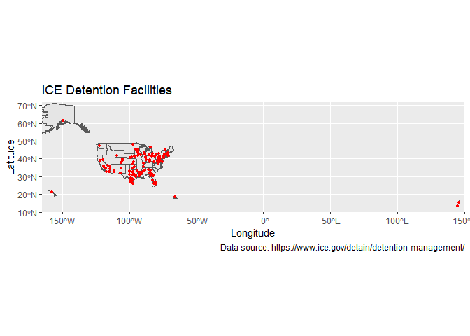
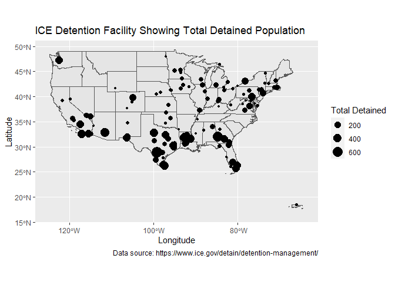
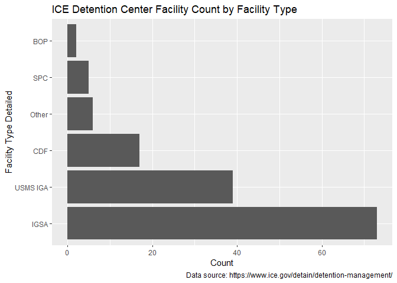
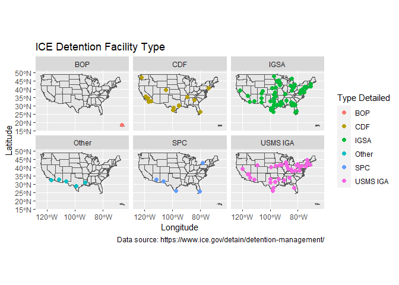
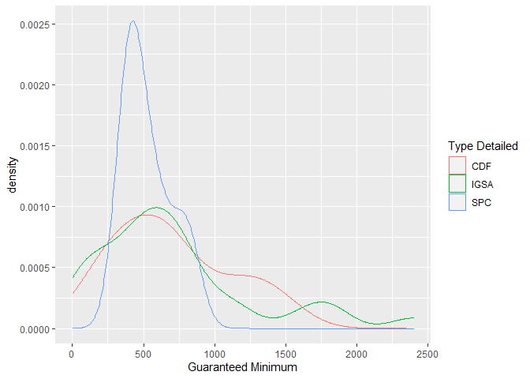
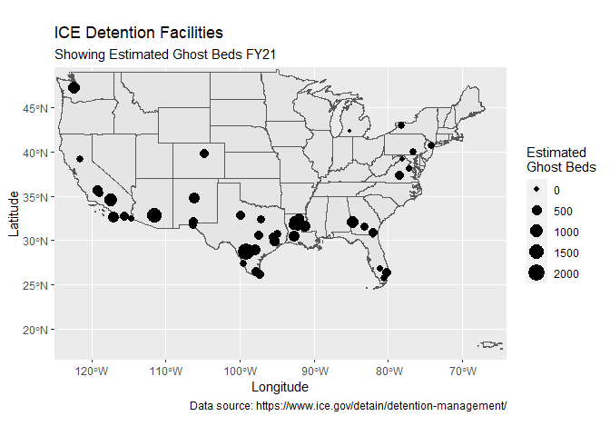
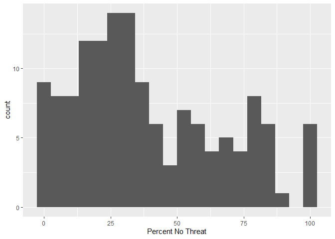
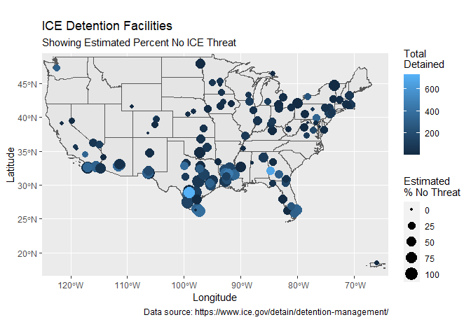
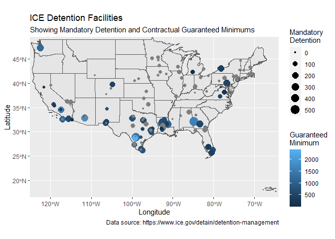

# Introduction {#introduction}

This document represents exploratory data analysis of ICE's Fiscal FY21 Year End Detention Report. I downloaded the data on 15 April 2021, so the report should represent the first 6 months of FY21 (see below). Analysis was performed in R Studio, written in Rmarkdown, and all code is supplied in the [Appendix](#appendix-a-code-used-in-document).


## Data

The FY21 Year End Report was downloaded from the [ICE Detention Management](https://www.ice.gov/detain/detention-management) webpage on 15 Apr 2021. FY21 ends on 30 September 2021, so the data in the table represent the first half of FY21. The data are likely to change over the course of the last half of FY21.

For mapping purposes, facility coordinates were based on facility address and established using [Geocodio](https://www.geocod.io/). The coordinates were appended to the original table in Excel. The geocoded file is available in the [data directory](https://github.com/n8craig/IDE-Detention-Year-End-Reports/tree/main/data) of the project GitHub repository.


The map below plots all 142 ICE detention facilities listed in the FY21 year end spreadsheet. Note there are five facilities located outside of the continental US. These are from West to East:

-   Honolulu Federal Detention Center, HI
-   Hiland Mountain Correctional Center, AK
-   Guaynabo MDC PR
-   Department Of Corrections GU
-   Saipan Department Of Corrections MP

<!-- -->

# Summary Statistics

The table below reports summary statistics of the numeric values provided in the ICE FY21 Year End Detention Report Table. Of the 142 facilities reported the average total detained is 109 persons (SD = 138.54, Median = 54.23). On 15 April 2021, the day the data were downloaded, ICE [reported](https://web.archive.org/web/20210415204059/https://www.ice.gov/coronavirus#detStat) there were 15,344 persons in detention. An average detained population of 109 x 142 facilities results in 15478 which is very similar to the total detained population reported by ICE.


|                               |     Mean| Std.Dev|      Min|   Median|      Max|
|:------------------------------|--------:|-------:|--------:|--------:|--------:|
|Female Crim                    |     3.07|    6.76|     0.00|     0.04|    51.50|
|Female Non-Crim                |     9.17|   28.14|     0.00|     0.09|   188.14|
|FY21 ALOS                      |    66.04|   67.93|     0.75|    53.45|   378.75|
|Guaranteed Minimum             |   687.80|  493.90|     2.00|   580.00|  2400.00|
|ICE Threat Level 1             |    31.71|   45.49|     0.00|    14.17|   275.59|
|ICE Threat Level 2             |    12.06|   16.05|     0.00|     6.29|    98.26|
|ICE Threat Level 3             |    11.49|   15.73|     0.00|     5.66|    93.87|
|Level A                        |    45.82|   84.22|     0.00|     8.86|   506.74|
|Level B                        |    16.76|   26.19|     0.00|     6.56|   155.75|
|Level C                        |    23.81|   33.46|     0.00|    10.14|   183.41|
|Level D                        |    23.04|   34.34|     0.00|     9.87|   181.38|
|Male Crim                      |    52.25|   71.06|     0.00|    26.36|   465.87|
|Male Non-Crim                  |    44.93|   76.76|     0.00|    11.71|   513.02|
|Mandatory                      |    74.75|   95.60|     0.00|    35.15|   526.37|
|No ICE Threat Level            |    54.17|   87.14|     0.00|    14.22|   512.59|
|Percent No Threat              |    39.10|   27.54|     0.00|    31.96|   100.00|
|Second to Last Inspection Date | 43514.23|  703.61| 39241.00| 43695.50| 44265.00|
|Total Detained                 |   109.43|  138.54|     0.02|    54.23|   733.71|
|Total Females Detained         |    12.25|   31.34|     0.00|     0.24|   194.94|
|Total Males Detained           |    97.18|  129.33|     0.00|    47.59|   733.61|

The table below lists ranked by the total detained population and the map following plots all facilities illustrating the total detained population by the size of the point. Once can see that the facilities with the largest detained populations are located along the southern border with large concentrations in southern California, West Texas, South Texas, Louisiana, South Georgia, and South Florida. Of the facilities with the most number of detained persons, 9 of the 10 are private (either CDF or IGSA). In fact, 18 of the 20 facilities with the largest total detained population are private.

<div data-pagedtable="false">
  <script data-pagedtable-source type="application/json">
{"columns":[{"label":["Name"],"name":[1],"type":["chr"],"align":["left"]},{"label":["State"],"name":[2],"type":["chr"],"align":["left"]},{"label":["Type Detailed"],"name":[3],"type":["chr"],"align":["left"]},{"label":["Total Detained"],"name":[4],"type":["dbl"],"align":["right"]}],"data":[{"1":"South Texas ICE Processing Center","2":"TX","3":"CDF","4":"734"},{"1":"Stewart Detention Center","2":"GA","3":"IGSA","4":"673"},{"1":"Lasalle ICE Processing Center (Jena)","2":"LA","3":"IGSA","4":"465"},{"1":"La Palma Correctional Center","2":"AZ","3":"IGSA","4":"429"},{"1":"Port Isabel","2":"TX","3":"SPC","4":"392"},{"1":"Eloy Federal Contract Facility","2":"AZ","3":"IGSA","4":"381"},{"1":"La Palma Correction Center - Apso","2":"AZ","3":"IGSA","4":"379"},{"1":"Bluebonnet Detention Facility","2":"TX","3":"IGSA","4":"374"},{"1":"Winn Correctional Center","2":"LA","3":"IGSA","4":"365"},{"1":"Otay Mesa Detention Center (San Diego Cdf)","2":"CA","3":"CDF","4":"352"},{"1":"Adams County Det Center","2":"MS","3":"IGSA","4":"349"},{"1":"Adelanto ICE Processing Center","2":"CA","3":"CDF","4":"336"},{"1":"Broward Transitional Center","2":"FL","3":"CDF","4":"330"},{"1":"Montgomery ICE Processing Center","2":"TX","3":"CDF","4":"328"},{"1":"York County Prison","2":"PA","3":"IGSA","4":"326"},{"1":"El Valle Detention Facility","2":"TX","3":"IGSA","4":"326"},{"1":"El Paso Service Processing Center","2":"TX","3":"SPC","4":"322"},{"1":"Imperial Regional Detention Facility","2":"CA","3":"CDF","4":"315"},{"1":"Irwin County Detention Center","2":"GA","3":"IGSA","4":"314"},{"1":"Tacoma ICE Processing Center (Northwest Det Ctr)","2":"WA","3":"CDF","4":"311"},{"1":"Krome North Service Processing Center","2":"FL","3":"SPC","4":"309"},{"1":"South Texas Family Residential Center","2":"TX","3":"IGSA","4":"299"},{"1":"Prairieland Detention Facility","2":"TX","3":"IGSA","4":"293"},{"1":"Glades County Detention Center","2":"FL","3":"IGSA","4":"256"},{"1":"Buffalo (Batavia) Service Processing Center","2":"NY","3":"SPC","4":"252"},{"1":"Denver Contract Detention Facility","2":"CO","3":"CDF","4":"219"},{"1":"Pine Prairie ICE Processing Center","2":"LA","3":"IGSA","4":"216"},{"1":"Essex County Correctional Facility","2":"NJ","3":"IGSA","4":"210"},{"1":"Houston Contract Detention Facility","2":"TX","3":"CDF","4":"190"},{"1":"Otero County Processing Center","2":"NM","3":"IGSA","4":"188"},{"1":"Jackson Parish Correctional Center","2":"LA","3":"IGSA","4":"184"},{"1":"Caroline Detention Facility","2":"VA","3":"IGSA","4":"176"},{"1":"Baker County Sheriff'S Office","2":"FL","3":"IGSA","4":"163"},{"1":"Bergen County Jail","2":"NJ","3":"USMS IGA","4":"160"},{"1":"Richwood Correctional Center","2":"LA","3":"IGSA","4":"156"},{"1":"Rio Grande Detention Center","2":"TX","3":"CDF","4":"154"},{"1":"Limestone County Detention Center","2":"TX","3":"USMS IGA","4":"147"},{"1":"River Correctional Center","2":"LA","3":"IGSA","4":"139"},{"1":"Alexandria Staging Facility","2":"LA","3":"Other","4":"125"},{"1":"Henderson Detention Center","2":"NV","3":"USMS IGA","4":"125"},{"1":"Folkston Main Ipc","2":"GA","3":"IGSA","4":"123"},{"1":"Calhoun County Correctional Center","2":"MI","3":"IGSA","4":"114"},{"1":"Karnes County Residential Center","2":"TX","3":"IGSA","4":"112"},{"1":"Mchenry County Correctional Facility","2":"IL","3":"USMS IGA","4":"108"},{"1":"Elizabeth Contract Detention Facility","2":"NJ","3":"CDF","4":"102"},{"1":"Immigration Centers Of America Farmville","2":"VA","3":"IGSA","4":"101"},{"1":"Etowah County Jail (Alabama)","2":"AL","3":"USMS IGA","4":"97"},{"1":"Laredo Processing Center","2":"TX","3":"IGSA","4":"96"},{"1":"Eden Detention Center","2":"TX","3":"USMS IGA","4":"95"},{"1":"Butler County Jail","2":"OH","3":"IGSA","4":"92"},{"1":"Pulaski County Jail","2":"IL","3":"IGSA","4":"86"},{"1":"Webb County Detention Center (Cca)","2":"TX","3":"IGSA","4":"85"},{"1":"Cca, Florence Correctional Center","2":"AZ","3":"USMS IGA","4":"84"},{"1":"Golden State Annex","2":"CA","3":"CDF","4":"84"},{"1":"South Louisiana Detention Center","2":"LA","3":"IGSA","4":"83"},{"1":"Nevada Southern Detention Center","2":"NV","3":"USMS IGA","4":"83"},{"1":"Plymouth County Correctional Facility","2":"MA","3":"IGSA","4":"81"},{"1":"Clinton County Correctional Facility","2":"PA","3":"USMS IGA","4":"80"},{"1":"Okmulgee County Jail","2":"OK","3":"IGSA","4":"79"},{"1":"Iah Secure Adult Detention Facility (Polk)","2":"TX","3":"IGSA","4":"76"},{"1":"Florence Service Processing Center","2":"AZ","3":"SPC","4":"73"},{"1":"T. Don Hutto Detention Center","2":"TX","3":"IGSA","4":"71"},{"1":"Strafford County Corrections","2":"NH","3":"IGSA","4":"71"},{"1":"Hudson County Correctional Center","2":"NJ","3":"IGSA","4":"71"},{"1":"Kandiyohi County Jail","2":"MN","3":"IGSA","4":"70"},{"1":"Dodge County Jail","2":"WI","3":"USMS IGA","4":"70"},{"1":"Orange County Jail","2":"NY","3":"IGSA","4":"70"},{"1":"Nye County Detention Center, Southern (Pahrump)","2":"NV","3":"IGSA","4":"66"},{"1":"Sherburne County Jail","2":"MN","3":"IGSA","4":"65"},{"1":"Allen Parish Public Safety Complex","2":"LA","3":"IGSA","4":"65"},{"1":"Boone County Jail","2":"KY","3":"USMS IGA","4":"55"},{"1":"San Luis Regional Detention Center","2":"AZ","3":"IGSA","4":"54"},{"1":"Clay County Jail","2":"IN","3":"USMS IGA","4":"52"},{"1":"Freeborn County Adult Detention Center","2":"MN","3":"IGSA","4":"49"},{"1":"Chase County Detention Facility","2":"KS","3":"IGSA","4":"49"},{"1":"Kay County Justice Facility","2":"OK","3":"IGSA","4":"48"},{"1":"Wakulla County Jail","2":"FL","3":"IGSA","4":"48"},{"1":"Pike County Correctional Facility","2":"PA","3":"IGSA","4":"43"},{"1":"Mesa Verde ICE Processing Center","2":"CA","3":"CDF","4":"43"},{"1":"Annex - Folkston Ipc","2":"GA","3":"IGSA","4":"38"},{"1":"Denver Contract Detention Facility (Cdf) Ii","2":"CO","3":"CDF","4":"38"},{"1":"Hardin County Jail","2":"IA","3":"IGSA","4":"37"},{"1":"Florence Staging Facility","2":"AZ","3":"Other","4":"37"},{"1":"Rolling Plains Detention Center","2":"TX","3":"USMS IGA","4":"37"},{"1":"Kankakee County Jail (Jerome Combs Det Ctr)","2":"IL","3":"USMS IGA","4":"37"},{"1":"Joe Corley Processing Ctr","2":"TX","3":"IGSA","4":"33"},{"1":"Johnson County Corrections Center","2":"TX","3":"IGSA","4":"32"},{"1":"Wyatt Detention Center","2":"RI","3":"USMS IGA","4":"31"},{"1":"Saint Clair County Jail","2":"MI","3":"IGSA","4":"27"},{"1":"Polk County Jail","2":"IA","3":"USMS IGA","4":"27"},{"1":"Seneca County Jail","2":"OH","3":"IGSA","4":"27"},{"1":"Torrance County Detention Facility","2":"NM","3":"IGSA","4":"24"},{"1":"Geauga County Jail","2":"OH","3":"USMS IGA","4":"24"},{"1":"Franklin County House Of Correction","2":"MA","3":"USMS IGA","4":"22"},{"1":"Department Of Corrections Hagatna","2":"GU","3":"USMS IGA","4":"22"},{"1":"Hall County Department Of Corrections","2":"NE","3":"IGSA","4":"22"},{"1":"Worcester County Jail","2":"MD","3":"IGSA","4":"21"},{"1":"Yuba County Jail","2":"CA","3":"IGSA","4":"20"},{"1":"Bristol County Detention Center","2":"MA","3":"IGSA","4":"20"},{"1":"Honolulu Federal Detention Center","2":"HI","3":"BOP","4":"18"},{"1":"Phelps County Jail","2":"NE","3":"USMS IGA","4":"16"},{"1":"Robert A. Deyton Detention Facility","2":"GA","3":"CDF","4":"16"},{"1":"Douglas County Department Of Corrections","2":"NE","3":"IGSA","4":"16"},{"1":"Howard County Detention Center","2":"MD","3":"IGSA","4":"13"},{"1":"Cbp Chula Vista Bps","2":"CA","3":"Other","4":"13"},{"1":"Desert View","2":"CA","3":"CDF","4":"13"},{"1":"Washoe County Jail","2":"NV","3":"USMS IGA","4":"10"},{"1":"Chippewa County Ssm","2":"MI","3":"IGSA","4":"9"},{"1":"Monroe County Detention-Dorm","2":"MI","3":"IGSA","4":"8"},{"1":"Cambria County Jail","2":"PA","3":"USMS IGA","4":"7"},{"1":"Euless City Jail","2":"TX","3":"IGSA","4":"6"},{"1":"Rensselaer County Correctional Facility","2":"NY","3":"USMS IGA","4":"6"},{"1":"Clinton County Jail","2":"NY","3":"USMS IGA","4":"6"},{"1":"Pottawattamie County Jail","2":"IA","3":"USMS IGA","4":"6"},{"1":"Teller County Jail","2":"CO","3":"IGSA","4":"5"},{"1":"Saipan Department Of Corrections (Susupe)","2":"MP","3":"USMS IGA","4":"4"},{"1":"Carver County Jail","2":"MN","3":"IGSA","4":"4"},{"1":"Coastal Bend Detention Facility","2":"TX","3":"USMS IGA","4":"4"},{"1":"Collier County Naples Jail Center","2":"FL","3":"IGSA","4":"4"},{"1":"Pickens County Det Ctr","2":"AL","3":"IGSA","4":"3"},{"1":"Guaynabo Mdc (San Juan)","2":"PR","3":"BOP","4":"3"},{"1":"South Central Regional Jail","2":"WV","3":"USMS IGA","4":"2"},{"1":"Linn County Jail","2":"IA","3":"USMS IGA","4":"2"},{"1":"Garvin County Detention Center","2":"OK","3":"IGSA","4":"2"},{"1":"Cbp San Ysidro Poe","2":"CA","3":"Other","4":"2"},{"1":"East Hidalgo Detention Center","2":"TX","3":"USMS IGA","4":"2"},{"1":"Pinellas County Jail","2":"FL","3":"USMS IGA","4":"1"},{"1":"Fayette County Detention Center","2":"KY","3":"USMS IGA","4":"1"},{"1":"Madison County Jail","2":"MS","3":"USMS IGA","4":"1"},{"1":"Sweetwater County Jail","2":"WY","3":"USMS IGA","4":"1"},{"1":"Western Tennessee Detention Facility","2":"TN","3":"CDF","4":"1"},{"1":"La Paz County Adult Detention Facility","2":"AZ","3":"USMS IGA","4":"1"},{"1":"Erie County Jail","2":"PA","3":"USMS IGA","4":"0"},{"1":"Holiday Inn Express & Suites","2":"TX","3":"Other","4":"0"},{"1":"Grand Forks County Correctional Facility","2":"ND","3":"IGSA","4":"0"},{"1":"Rockingham County Jail","2":"VA","3":"USMS IGA","4":"0"},{"1":"Miller County Jail","2":"AR","3":"USMS IGA","4":"0"},{"1":"Dorchester County Detention Center","2":"MD","3":"IGSA","4":"0"},{"1":"Holiday Inn Express & Suites El Paso","2":"TX","3":"Other","4":"0"},{"1":"Rio Grande County Jail","2":"CO","3":"IGSA","4":"0"},{"1":"Hiland Mountain Correctional Center","2":"AK","3":"USMS IGA","4":"0"},{"1":"Northwestern Regional Juvenile Detention Center","2":"VA","3":"IGSA","4":"0"}],"options":{"columns":{"min":{},"max":[10]},"rows":{"min":[10],"max":[10]},"pages":{}}}
  </script>
</div>

<!-- -->

# Facility Types

The FY21 table lists 6 kinds of facilities. The table below shows the number and percent total of of each facility type. The following bar chart graphically represents the breakdown by facility type. IGSA's constitute more than half of the facilities.


<div data-pagedtable="false">
  <script data-pagedtable-source type="application/json">
{"columns":[{"label":["Type Detailed"],"name":[1],"type":["fct"],"align":["left"]},{"label":["n"],"name":[2],"type":["int"],"align":["right"]},{"label":["Percent Total"],"name":[3],"type":["dbl"],"align":["right"]}],"data":[{"1":"BOP","2":"2","3":"1.41"},{"1":"SPC","2":"5","3":"3.52"},{"1":"Other","2":"6","3":"4.23"},{"1":"CDF","2":"17","3":"11.97"},{"1":"USMS IGA","2":"39","3":"27.46"},{"1":"IGSA","2":"73","3":"51.41"}],"options":{"columns":{"min":{},"max":[10]},"rows":{"min":[10],"max":[10]},"pages":{}}}
  </script>
</div>

<!-- -->

The facet map below shows the location of facilities by type. One can see that CDF, IGSA, "Other", and SPC facilities are concentrated along the southern border. There is a large concentration of USMS IGA's located in the Northeast, but there is also a sizeable concentration of these facilities along the southern border, just like the other facility types.

<!-- -->

# Guaranteed Minimums


Of the 142 facilities listed in the FY21 ICE Detention Year End Report 35% (n = 50) have Guaranteed Minimums as part of their contracts. Based on data reported by ICE, there are a total of 34,390 guaranteed beds in FY21. The table below lists those facilities in descending order based on the Guaranteed Minimum number of beds stipulated in the contract.

<div data-pagedtable="false">
  <script data-pagedtable-source type="application/json">
{"columns":[{"label":["Name"],"name":[1],"type":["chr"],"align":["left"]},{"label":["Guaranteed Minimum"],"name":[2],"type":["dbl"],"align":["right"]},{"label":["Total Detained"],"name":[3],"type":["dbl"],"align":["right"]},{"label":["Mandatory"],"name":[4],"type":["dbl"],"align":["right"]},{"label":["Percent No Threat"],"name":[5],"type":["dbl"],"align":["right"]}],"data":[{"1":"South Texas Family Residential Center","2":"2400","3":"298.875676","4":"154.746","5":"99.5316"},{"1":"La Palma Correctional Center","2":"1800","3":"428.562162","4":"248.103","5":"77.4330"},{"1":"La Palma Correction Center - Apso","2":"1800","3":"378.654054","4":"247.103","5":"69.3109"},{"1":"Stewart Detention Center","2":"1600","3":"673.232432","4":"526.373","5":"30.5256"},{"1":"Adelanto ICE Processing Center","2":"1455","3":"335.691892","4":"220.703","5":"12.6789"},{"1":"South Texas ICE Processing Center","2":"1350","3":"733.708108","4":"464.238","5":"69.8628"},{"1":"Tacoma ICE Processing Center (Northwest Det Ctr)","2":"1181","3":"310.708108","4":"247.730","5":"16.2749"},{"1":"Lasalle ICE Processing Center (Jena)","2":"1170","3":"465.070270","4":"343.816","5":"54.9432"},{"1":"Otay Mesa Detention Center (San Diego Cdf)","2":"1100","3":"352.297297","4":"226.600","5":"53.9455"},{"1":"Adams County Det Center","2":"1100","3":"348.621622","4":"317.978","5":"65.6004"},{"1":"Winn Correctional Center","2":"946","3":"365.162162","4":"300.908","5":"57.1460"},{"1":"Karnes County Residential Center","2":"830","3":"112.291892","4":"34.119","5":"99.7689"},{"1":"Port Isabel","2":"800","3":"391.864865","4":"190.184","5":"83.1423"},{"1":"Jackson Parish Correctional Center","2":"751","3":"183.562162","4":"144.216","5":"73.1058"},{"1":"Bluebonnet Detention Facility","2":"750","3":"373.870270","4":"226.692","5":"31.0384"},{"1":"Montgomery ICE Processing Center","2":"750","3":"328.475676","4":"206.892","5":"46.5064"},{"1":"El Valle Detention Facility","2":"750","3":"326.356757","4":"175.438","5":"83.6508"},{"1":"Houston Contract Detention Facility","2":"750","3":"189.589189","4":"123.946","5":"59.1378"},{"1":"Torrance County Detention Facility","2":"714","3":"24.389189","4":"21.238","5":"41.9548"},{"1":"Broward Transitional Center","2":"700","3":"330.308108","4":"192.919","5":"77.8912"},{"1":"South Louisiana Detention Center","2":"700","3":"83.481081","4":"73.124","5":"71.5877"},{"1":"Richwood Correctional Center","2":"677","3":"155.556757","4":"134.103","5":"80.6484"},{"1":"Imperial Regional Detention Facility","2":"640","3":"314.902703","4":"202.627","5":"79.6660"},{"1":"El Paso Service Processing Center","2":"600","3":"322.232432","4":"158.697","5":"68.1177"},{"1":"Irwin County Detention Center","2":"600","3":"313.859459","4":"247.524","5":"31.8993"},{"1":"Golden State Annex","2":"560","3":"83.605405","4":"63.811","5":"3.7499"},{"1":"Prairieland Detention Facility","2":"550","3":"293.248649","4":"214.373","5":"31.7598"},{"1":"Folkston Main Ipc","2":"544","3":"123.167568","4":"50.195","5":"40.0641"},{"1":"Denver Contract Detention Facility","2":"525","3":"219.113514","4":"153.876","5":"19.4050"},{"1":"York County Prison","2":"500","3":"326.470270","4":"249.530","5":"22.9846"},{"1":"Otero County Processing Center","2":"500","3":"188.005405","4":"125.422","5":"55.9127"},{"1":"Immigration Centers Of America Farmville","2":"500","3":"100.962162","4":"69.789","5":"16.0563"},{"1":"T. Don Hutto Detention Center","2":"461","3":"71.443243","4":"52.184","5":"97.9118"},{"1":"Krome North Service Processing Center","2":"450","3":"309.378378","4":"216.551","5":"31.1278"},{"1":"Denver Contract Detention Facility (Cdf) Ii","2":"432","3":"38.102703","4":"27.800","5":"11.3917"},{"1":"Buffalo (Batavia) Service Processing Center","2":"400","3":"252.291892","4":"218.265","5":"18.6271"},{"1":"Florence Service Processing Center","2":"392","3":"72.551351","4":"43.795","5":"60.6020"},{"1":"River Correctional Center","2":"361","3":"139.454054","4":"109.216","5":"79.9953"},{"1":"Iah Secure Adult Detention Facility (Polk)","2":"350","3":"75.972973","4":"63.557","5":"60.3273"},{"1":"Mesa Verde ICE Processing Center","2":"320","3":"43.210811","4":"38.627","5":"2.3142"},{"1":"Glades County Detention Center","2":"300","3":"255.875676","4":"170.778","5":"28.3140"},{"1":"Elizabeth Contract Detention Facility","2":"285","3":"102.000000","4":"57.935","5":"75.5379"},{"1":"Rio Grande Detention Center","2":"275","3":"154.335135","4":"117.914","5":"69.8655"},{"1":"Caroline Detention Facility","2":"224","3":"176.005405","4":"107.589","5":"19.3606"},{"1":"Yuba County Jail","2":"150","3":"19.956757","4":"16.849","5":"2.4648"},{"1":"Desert View","2":"120","3":"12.627027","4":"11.200","5":"14.8973"},{"1":"Allen Parish Public Safety Complex","2":"100","3":"64.772973","4":"54.654","5":"83.9940"},{"1":"San Luis Regional Detention Center","2":"100","3":"53.843243","4":"30.643","5":"65.3248"},{"1":"Calhoun County Correctional Center","2":"75","3":"113.978378","4":"82.730","5":"18.1827"},{"1":"Northwestern Regional Juvenile Detention Center","2":"2","3":"0.016216","4":"0.000","5":"0.0000"}],"options":{"columns":{"min":{},"max":[10]},"rows":{"min":[10],"max":[10]},"pages":{}}}
  </script>
</div><!-- -->


```
Joining, by = "Type Detailed"
Joining, by = "Type Detailed"
```

<div data-pagedtable="false">
  <script data-pagedtable-source type="application/json">
{"columns":[{"label":["Type Detailed"],"name":[1],"type":["fct"],"align":["left"]},{"label":["n"],"name":[2],"type":["int"],"align":["right"]},{"label":["Prop Total"],"name":[3],"type":["dbl"],"align":["right"]},{"label":["n Guaranteed Min"],"name":[4],"type":["int"],"align":["right"]},{"label":["Guaranteed Min %"],"name":[5],"type":["dbl"],"align":["right"]},{"label":["Total Guaranteed Min"],"name":[6],"type":["dbl"],"align":["right"]}],"data":[{"1":"BOP","2":"2","3":"0.01","4":"NA","5":"NA","6":"NA"},{"1":"Other","2":"6","3":"0.04","4":"NA","5":"NA","6":"NA"},{"1":"SPC","2":"5","3":"0.04","4":"5","5":"100.000","6":"2642"},{"1":"CDF","2":"17","3":"0.12","4":"15","5":"88.235","6":"10443"},{"1":"USMS IGA","2":"39","3":"0.27","4":"NA","5":"NA","6":"NA"},{"1":"IGSA","2":"73","3":"0.51","4":"30","5":"41.096","6":"21305"}],"options":{"columns":{"min":{},"max":[10]},"rows":{"min":[10],"max":[10]},"pages":{}}}
  </script>
</div>


```
`summarise()` has grouped output by 'Type Detailed'. You can override using the `.groups` argument.
```

                    &nbsp;     Mean   Std.Dev      Min   Median       Max   N.Valid   Pct.Valid
-------------------------- -------- --------- -------- -------- --------- --------- -----------
   **Type Detailed = CDF**   696.20    409.53   120.00   640.00   1455.00     15.00      100.00
  **Type Detailed = IGSA**   710.17    567.57     2.00   575.00   2400.00     30.00      100.00
   **Type Detailed = SPC**   528.40    173.30   392.00   450.00    800.00      5.00      100.00

## Estimated number of "Ghost Beds"

Selman and Leighton [-@selman2010, 114] explain that compensation for private prisons is fraught with guarantees, including the payment of a minimum number of inmates which over time became standard language in many contracts. Selman and Leighton refer to the payment of nonexistent inmate beds through guaranteed minimums as "ghost inmates." Immigration detention is modeled on corrections and is effectively punishment imposed through a program of prevention through deterrence. However, individuals incarcerated by ICE are held in what is supposed to be non-punitive civil custody. Therefore, rather than referring to empty guaranteed beds that are paid for through contractual obligations as "ghost inmates" I refer to these in the immigration context as "ghost beds."

<div data-pagedtable="false">
  <script data-pagedtable-source type="application/json">
{"columns":[{"label":["Name"],"name":[1],"type":["chr"],"align":["left"]},{"label":["Estimated Ghost Beds"],"name":[2],"type":["dbl"],"align":["right"]},{"label":["Guaranteed Minimum"],"name":[3],"type":["dbl"],"align":["right"]},{"label":["Total Detained"],"name":[4],"type":["dbl"],"align":["right"]},{"label":["Percent No Threat"],"name":[5],"type":["dbl"],"align":["right"]}],"data":[{"1":"South Texas Family Residential Center","2":"2101.1243","3":"2400","4":"298.875676","5":"99.5316"},{"1":"La Palma Correction Center - Apso","2":"1421.3459","3":"1800","4":"378.654054","5":"69.3109"},{"1":"La Palma Correctional Center","2":"1371.4378","3":"1800","4":"428.562162","5":"77.4330"},{"1":"Adelanto ICE Processing Center","2":"1119.3081","3":"1455","4":"335.691892","5":"12.6789"},{"1":"Stewart Detention Center","2":"926.7676","3":"1600","4":"673.232432","5":"30.5256"},{"1":"Tacoma ICE Processing Center (Northwest Det Ctr)","2":"870.2919","3":"1181","4":"310.708108","5":"16.2749"},{"1":"Adams County Det Center","2":"751.3784","3":"1100","4":"348.621622","5":"65.6004"},{"1":"Otay Mesa Detention Center (San Diego Cdf)","2":"747.7027","3":"1100","4":"352.297297","5":"53.9455"},{"1":"Karnes County Residential Center","2":"717.7081","3":"830","4":"112.291892","5":"99.7689"},{"1":"Lasalle ICE Processing Center (Jena)","2":"704.9297","3":"1170","4":"465.070270","5":"54.9432"},{"1":"Torrance County Detention Facility","2":"689.6108","3":"714","4":"24.389189","5":"41.9548"},{"1":"South Louisiana Detention Center","2":"616.5189","3":"700","4":"83.481081","5":"71.5877"},{"1":"South Texas ICE Processing Center","2":"616.2919","3":"1350","4":"733.708108","5":"69.8628"},{"1":"Winn Correctional Center","2":"580.8378","3":"946","4":"365.162162","5":"57.1460"},{"1":"Jackson Parish Correctional Center","2":"567.4378","3":"751","4":"183.562162","5":"73.1058"},{"1":"Houston Contract Detention Facility","2":"560.4108","3":"750","4":"189.589189","5":"59.1378"},{"1":"Richwood Correctional Center","2":"521.4432","3":"677","4":"155.556757","5":"80.6484"},{"1":"Golden State Annex","2":"476.3946","3":"560","4":"83.605405","5":"3.7499"},{"1":"El Valle Detention Facility","2":"423.6432","3":"750","4":"326.356757","5":"83.6508"},{"1":"Montgomery ICE Processing Center","2":"421.5243","3":"750","4":"328.475676","5":"46.5064"},{"1":"Folkston Main Ipc","2":"420.8324","3":"544","4":"123.167568","5":"40.0641"},{"1":"Port Isabel","2":"408.1351","3":"800","4":"391.864865","5":"83.1423"},{"1":"Immigration Centers Of America Farmville","2":"399.0378","3":"500","4":"100.962162","5":"16.0563"},{"1":"Denver Contract Detention Facility (Cdf) Ii","2":"393.8973","3":"432","4":"38.102703","5":"11.3917"},{"1":"T. Don Hutto Detention Center","2":"389.5568","3":"461","4":"71.443243","5":"97.9118"},{"1":"Bluebonnet Detention Facility","2":"376.1297","3":"750","4":"373.870270","5":"31.0384"},{"1":"Broward Transitional Center","2":"369.6919","3":"700","4":"330.308108","5":"77.8912"},{"1":"Imperial Regional Detention Facility","2":"325.0973","3":"640","4":"314.902703","5":"79.6660"},{"1":"Florence Service Processing Center","2":"319.4486","3":"392","4":"72.551351","5":"60.6020"},{"1":"Otero County Processing Center","2":"311.9946","3":"500","4":"188.005405","5":"55.9127"},{"1":"Denver Contract Detention Facility","2":"305.8865","3":"525","4":"219.113514","5":"19.4050"},{"1":"Irwin County Detention Center","2":"286.1405","3":"600","4":"313.859459","5":"31.8993"},{"1":"El Paso Service Processing Center","2":"277.7676","3":"600","4":"322.232432","5":"68.1177"},{"1":"Mesa Verde ICE Processing Center","2":"276.7892","3":"320","4":"43.210811","5":"2.3142"},{"1":"Iah Secure Adult Detention Facility (Polk)","2":"274.0270","3":"350","4":"75.972973","5":"60.3273"},{"1":"Prairieland Detention Facility","2":"256.7514","3":"550","4":"293.248649","5":"31.7598"},{"1":"River Correctional Center","2":"221.5459","3":"361","4":"139.454054","5":"79.9953"},{"1":"Elizabeth Contract Detention Facility","2":"183.0000","3":"285","4":"102.000000","5":"75.5379"},{"1":"York County Prison","2":"173.5297","3":"500","4":"326.470270","5":"22.9846"},{"1":"Buffalo (Batavia) Service Processing Center","2":"147.7081","3":"400","4":"252.291892","5":"18.6271"},{"1":"Krome North Service Processing Center","2":"140.6216","3":"450","4":"309.378378","5":"31.1278"},{"1":"Yuba County Jail","2":"130.0432","3":"150","4":"19.956757","5":"2.4648"},{"1":"Rio Grande Detention Center","2":"120.6649","3":"275","4":"154.335135","5":"69.8655"},{"1":"Desert View","2":"107.3730","3":"120","4":"12.627027","5":"14.8973"},{"1":"Caroline Detention Facility","2":"47.9946","3":"224","4":"176.005405","5":"19.3606"},{"1":"San Luis Regional Detention Center","2":"46.1568","3":"100","4":"53.843243","5":"65.3248"},{"1":"Glades County Detention Center","2":"44.1243","3":"300","4":"255.875676","5":"28.3140"},{"1":"Allen Parish Public Safety Complex","2":"35.2270","3":"100","4":"64.772973","5":"83.9940"},{"1":"Northwestern Regional Juvenile Detention Center","2":"1.9838","3":"2","4":"0.016216","5":"0.0000"},{"1":"Calhoun County Correctional Center","2":"-38.9784","3":"75","4":"113.978378","5":"18.1827"}],"options":{"columns":{"min":{},"max":[10]},"rows":{"min":[10],"max":[10]},"pages":{}}}
  </script>
</div>


Based on ICE data, for FY21 there are a total of 22,958 ghost beds. Assuming an average cost of \$100 per day per bed, this comes out to \$2,295,829 per day paid for empty detention beds.

<!-- -->

# Threat Level

<div data-pagedtable="false">
  <script data-pagedtable-source type="application/json">
{"columns":[{"label":["Name"],"name":[1],"type":["chr"],"align":["left"]},{"label":["Percent No Threat"],"name":[2],"type":["dbl"],"align":["right"]},{"label":["Total Detained"],"name":[3],"type":["dbl"],"align":["right"]}],"data":[{"1":"Holiday Inn Express & Suites","2":"100.00000","3":"0.475676"},{"1":"Holiday Inn Express & Suites El Paso","2":"100.00000","3":"0.118919"},{"1":"Hiland Mountain Correctional Center","2":"100.00000","3":"0.027027"},{"1":"Karnes County Residential Center","2":"99.76894","3":"112.291892"},{"1":"South Texas Family Residential Center","2":"99.53158","3":"298.875676"},{"1":"T. Don Hutto Detention Center","2":"97.91178","3":"71.443243"},{"1":"Cbp Chula Vista Bps","2":"90.17021","3":"12.702703"},{"1":"Cbp San Ysidro Poe","2":"86.28049","3":"1.772973"},{"1":"Cca, Florence Correctional Center","2":"85.64529","3":"83.935135"},{"1":"Allen Parish Public Safety Complex","2":"83.99399","3":"64.772973"},{"1":"El Valle Detention Facility","2":"83.65079","3":"326.356757"},{"1":"Port Isabel","2":"83.14229","3":"391.864865"},{"1":"Webb County Detention Center (Cca)","2":"81.94339","3":"85.167568"},{"1":"Richwood Correctional Center","2":"80.64841","3":"155.556757"},{"1":"River Correctional Center","2":"79.99535","3":"139.454054"},{"1":"Clinton County Jail","2":"79.71292","3":"5.648649"},{"1":"Imperial Regional Detention Facility","2":"79.66596","3":"314.902703"},{"1":"Broward Transitional Center","2":"77.89124","3":"330.308108"},{"1":"La Palma Correctional Center","2":"77.43303","3":"428.562162"},{"1":"Limestone County Detention Center","2":"76.59661","3":"146.594595"},{"1":"Eloy Federal Contract Facility","2":"76.42941","3":"381.464865"},{"1":"Elizabeth Contract Detention Facility","2":"75.53789","3":"102.000000"},{"1":"Laredo Processing Center","2":"74.93359","3":"95.637838"},{"1":"Jackson Parish Correctional Center","2":"73.10580","3":"183.562162"},{"1":"South Louisiana Detention Center","2":"71.58767","3":"83.481081"},{"1":"Rio Grande Detention Center","2":"69.86551","3":"154.335135"},{"1":"South Texas ICE Processing Center","2":"69.86282","3":"733.708108"},{"1":"La Palma Correction Center - Apso","2":"69.31093","3":"378.654054"},{"1":"El Paso Service Processing Center","2":"68.11769","3":"322.232432"},{"1":"Garvin County Detention Center","2":"67.87709","3":"1.935135"},{"1":"Adams County Det Center","2":"65.60043","3":"348.621622"},{"1":"San Luis Regional Detention Center","2":"65.32477","3":"53.843243"},{"1":"Madison County Jail","2":"64.21569","3":"1.102703"},{"1":"Florence Service Processing Center","2":"60.60200","3":"72.551351"},{"1":"Iah Secure Adult Detention Facility (Polk)","2":"60.32729","3":"75.972973"},{"1":"Houston Contract Detention Facility","2":"59.13782","3":"189.589189"},{"1":"Erie County Jail","2":"58.24176","3":"0.491892"},{"1":"Winn Correctional Center","2":"57.14603","3":"365.162162"},{"1":"Joe Corley Processing Ctr","2":"56.06860","3":"32.778378"},{"1":"Otero County Processing Center","2":"55.91271","3":"188.005405"},{"1":"Pine Prairie ICE Processing Center","2":"55.25987","3":"216.324324"},{"1":"Lasalle ICE Processing Center (Jena)","2":"54.94316","3":"465.070270"},{"1":"Otay Mesa Detention Center (San Diego Cdf)","2":"53.94553","3":"352.297297"},{"1":"Grand Forks County Correctional Facility","2":"53.44828","3":"0.313514"},{"1":"Euless City Jail","2":"50.77720","3":"6.259459"},{"1":"Coastal Bend Detention Facility","2":"50.69708","3":"4.264865"},{"1":"Etowah County Jail (Alabama)","2":"50.27899","3":"96.875676"},{"1":"Montgomery ICE Processing Center","2":"46.50638","3":"328.475676"},{"1":"Florence Staging Facility","2":"45.49020","3":"37.216216"},{"1":"Strafford County Corrections","2":"44.93810","3":"71.172973"},{"1":"Clay County Jail","2":"44.10209","3":"52.102703"},{"1":"Torrance County Detention Facility","2":"41.95479","3":"24.389189"},{"1":"Monroe County Detention-Dorm","2":"41.73855","3":"8.145946"},{"1":"Plymouth County Correctional Facility","2":"41.09342","3":"80.778378"},{"1":"Kay County Justice Facility","2":"40.34871","3":"48.054054"},{"1":"Folkston Main Ipc","2":"40.06407","3":"123.167568"},{"1":"Okmulgee County Jail","2":"39.42763","3":"78.762162"},{"1":"Rolling Plains Detention Center","2":"39.11700","3":"36.729730"},{"1":"Pinellas County Jail","2":"38.36207","3":"1.254054"},{"1":"Fayette County Detention Center","2":"38.24885","3":"1.172973"},{"1":"Collier County Naples Jail Center","2":"37.43094","3":"3.913514"},{"1":"Essex County Correctional Facility","2":"37.27983","3":"209.605405"},{"1":"Johnson County Corrections Center","2":"36.02818","3":"32.227027"},{"1":"Alexandria Staging Facility","2":"35.96927","3":"125.227027"},{"1":"Seneca County Jail","2":"34.59941","3":"27.324324"},{"1":"Orange County Jail","2":"33.47287","3":"69.729730"},{"1":"Mchenry County Correctional Facility","2":"33.38343","3":"107.902703"},{"1":"Wyatt Detention Center","2":"32.78088","3":"30.983784"},{"1":"Rockingham County Jail","2":"32.43243","3":"0.200000"},{"1":"Saint Clair County Jail","2":"32.36858","3":"27.454054"},{"1":"Pike County Correctional Facility","2":"32.02639","3":"43.427027"},{"1":"Irwin County Detention Center","2":"31.89928","3":"313.859459"},{"1":"Prairieland Detention Facility","2":"31.75978","3":"293.248649"},{"1":"Cambria County Jail","2":"31.73077","3":"6.745946"},{"1":"Krome North Service Processing Center","2":"31.12781","3":"309.378378"},{"1":"Bluebonnet Detention Facility","2":"31.03837","3":"373.870270"},{"1":"Stewart Detention Center","2":"30.52558","3":"673.232432"},{"1":"Pulaski County Jail","2":"30.48125","3":"86.486486"},{"1":"Nevada Southern Detention Center","2":"29.63975","3":"83.124324"},{"1":"Kankakee County Jail (Jerome Combs Det Ctr)","2":"28.91940","3":"36.616216"},{"1":"Boone County Jail","2":"28.82027","3":"54.616216"},{"1":"Rensselaer County Correctional Facility","2":"28.69490","3":"6.254054"},{"1":"Glades County Detention Center","2":"28.31400","3":"255.875676"},{"1":"Bergen County Jail","2":"28.16536","3":"160.308108"},{"1":"Robert A. Deyton Detention Facility","2":"27.48991","3":"16.064865"},{"1":"Baker County Sheriff'S Office","2":"26.98323","3":"162.783784"},{"1":"Eden Detention Center","2":"26.49377","3":"94.627027"},{"1":"Henderson Detention Center","2":"26.47314","3":"124.572973"},{"1":"Geauga County Jail","2":"25.60561","3":"23.875676"},{"1":"Butler County Jail","2":"25.36683","3":"92.097297"},{"1":"Chase County Detention Facility","2":"25.25197","3":"48.805405"},{"1":"Polk County Jail","2":"24.07041","3":"27.329730"},{"1":"Franklin County House Of Correction","2":"23.70572","3":"21.821622"},{"1":"Pottawattamie County Jail","2":"23.35623","3":"5.508108"},{"1":"Hudson County Correctional Center","2":"23.22492","3":"70.800000"},{"1":"York County Prison","2":"22.98459","3":"326.470270"},{"1":"Worcester County Jail","2":"22.27189","3":"20.556757"},{"1":"Freeborn County Adult Detention Center","2":"22.02585","3":"48.935135"},{"1":"Sherburne County Jail","2":"21.68304","3":"64.940541"},{"1":"Nye County Detention Center, Southern (Pahrump)","2":"19.83932","3":"65.935135"},{"1":"Denver Contract Detention Facility","2":"19.40497","3":"219.113514"},{"1":"Caroline Detention Facility","2":"19.36058","3":"176.005405"},{"1":"Kandiyohi County Jail","2":"19.18649","3":"70.432432"},{"1":"Bristol County Detention Center","2":"19.13258","3":"19.691892"},{"1":"Buffalo (Batavia) Service Processing Center","2":"18.62707","3":"252.291892"},{"1":"Annex - Folkston Ipc","2":"18.25732","3":"38.400000"},{"1":"Calhoun County Correctional Center","2":"18.18268","3":"113.978378"},{"1":"Teller County Jail","2":"17.24138","3":"4.702703"},{"1":"Miller County Jail","2":"16.66667","3":"0.162162"},{"1":"Wakulla County Jail","2":"16.32101","3":"47.956757"},{"1":"Tacoma ICE Processing Center (Northwest Det Ctr)","2":"16.27494","3":"310.708108"},{"1":"Linn County Jail","2":"16.22222","3":"2.432432"},{"1":"Immigration Centers Of America Farmville","2":"16.05632","3":"100.962162"},{"1":"Dodge County Jail","2":"15.62452","3":"69.848649"},{"1":"South Central Regional Jail","2":"15.21739","3":"2.486486"},{"1":"Desert View","2":"14.89726","3":"12.627027"},{"1":"Washoe County Jail","2":"13.25843","3":"9.621622"},{"1":"Adelanto ICE Processing Center","2":"12.67894","3":"335.691892"},{"1":"Denver Contract Detention Facility (Cdf) Ii","2":"11.39169","3":"38.102703"},{"1":"Hardin County Jail","2":"11.37811","3":"37.340541"},{"1":"La Paz County Adult Detention Facility","2":"11.22449","3":"0.529730"},{"1":"Western Tennessee Detention Facility","2":"10.82803","3":"0.848649"},{"1":"Hall County Department Of Corrections","2":"10.35429","3":"21.664865"},{"1":"Phelps County Jail","2":"10.10568","3":"16.367568"},{"1":"Chippewa County Ssm","2":"8.76644","3":"8.632432"},{"1":"Honolulu Federal Detention Center","2":"7.36906","3":"17.751351"},{"1":"Douglas County Department Of Corrections","2":"5.67944","3":"15.513514"},{"1":"Guaynabo Mdc (San Juan)","2":"5.63380","3":"2.686486"},{"1":"Howard County Detention Center","2":"4.39245","3":"13.167568"},{"1":"Golden State Annex","2":"3.74992","3":"83.605405"},{"1":"Saipan Department Of Corrections (Susupe)","2":"3.71287","3":"4.367568"},{"1":"Carver County Jail","2":"3.61596","3":"4.335135"},{"1":"Sweetwater County Jail","2":"2.74725","3":"0.983784"},{"1":"Yuba County Jail","2":"2.46479","3":"19.956757"},{"1":"Mesa Verde ICE Processing Center","2":"2.31424","3":"43.210811"},{"1":"Clinton County Correctional Facility","2":"1.99987","3":"80.275676"},{"1":"Pickens County Det Ctr","2":"1.35364","3":"3.194595"},{"1":"Department Of Corrections Hagatna","2":"0.37388","3":"21.686486"},{"1":"East Hidalgo Detention Center","2":"0.00000","3":"1.740541"},{"1":"Dorchester County Detention Center","2":"0.00000","3":"0.135135"},{"1":"Rio Grande County Jail","2":"0.00000","3":"0.081081"},{"1":"Northwestern Regional Juvenile Detention Center","2":"0.00000","3":"0.016216"}],"options":{"columns":{"min":{},"max":[10]},"rows":{"min":[10],"max":[10]},"pages":{}}}
  </script>
</div>

<!-- -->

<!-- -->

# Mandatory Detention

<!-- -->

# References

::: {#refs}
:::

# Appendix A: Code


```r
# Load libraries
library(sf)
library(ggplot2)
library(readxl)
library(tidyverse)
library(summarytools)
st_options(plain.ascii = FALSE,
           footnote = NA,
           subtitle.emphasis = FALSE,
           round.digits = 2)
library(knitr)
# knitr option that forces rounding
options(digits=3)
opts_chunk$set(results = 'asis',
               comment = NA,
               prompt = FALSE,
               cache = FALSE)
# knitr hook to put commas in the thousands place
# for inline numbers based on variables.
knit_hooks$set(inline = function(x) {
  prettyNum(x, big.mark=",")
})

# Turn off scientific notation
options(digits=5, scipen=15) 

# Load Datasets
facilities <- read_excel("data/facilities geocoded.xlsx")
states <- st_read("./map_data/cb_2018_us_state_500k.shp")

# Map of all facilities
ggplot()+
  geom_sf(data=states)+
  geom_point(data=facilities,
             aes(x=Longitude, y=Latitude), color = "Red", size = 1)+
    coord_sf(xlim = c(-165,150), ylim = c(10,72), expand = FALSE)+
  labs(
    title = "ICE Detention Facilities",
    caption = "Data source: https://www.ice.gov/detain/detention-management/"
    )

# Adding new columns
facilities <- facilities %>% 
  mutate(`Total Detained`=
           `Female Crim` +
           `Female Non-Crim` +
           `Male Crim` +
           `Male Non-Crim`) %>% 
  mutate(`Total Males Detained` =
           `Male Crim` +
           `Male Non-Crim`) %>% 
  mutate(`Total Females Detained` =
           `Female Crim` +
           `Female Non-Crim`) %>% 
  mutate(`Percent No Threat` =
            (`No ICE Threat Level` /
           `Total Detained`)*100) %>% 
  relocate(c(`Total Females Detained`,
             `Total Males Detained`,
             `Total Detained`,
             `Percent No Threat`), .after = `Guaranteed Minimum`)

# Creating a variable to use in the text
facilities %>% 
  select(c(-`Accuracy Score`, -Longitude, -Latitude, -Zip, -`Zip Geocoded`)) %>% 
  descr(stats = c("mean", "sd", "min", "med", "max"),
        transpose = TRUE,
        headings = FALSE) %>% 
  kable(digits = 2, scientific = FALSE)
# Facilities Ranked by Total Detained
facilities %>% 
  arrange(desc(`Total Detained`)) %>% 
  select(Name, State, `Type Detailed`, `Total Detained`) %>% 
  mutate(`Total Detained` = round(`Total Detained`,0))
  
# facilities by total detained
ggplot()+
  geom_sf(data=states)+
  geom_point(data=facilities,
             aes(x=Longitude, y=Latitude,
                 size = `Total Detained`))+
  scale_shape_discrete(solid = FALSE)+
  coord_sf(xlim = c(-125,-64), ylim = c(16.5, 49.5), expand = TRUE)+
  scale_x_continuous(breaks = c(-120, -100, -80))+
  labs(
    title = "ICE Detention Facility Showing Total Detained Population",
    caption = "Data source: https://www.ice.gov/detain/detention-management/"
    )

# convert character vector to factor vector
facilities$`Type Detailed` <- as.factor(facilities$`Type Detailed`)

# confirm the type is correct
class(facilities$`Type Detailed`)

# Facility count and percent total by facility type.
facility_types <- facilities %>% 
  count(`Type Detailed`) %>%
  mutate(`Percent Total` = prop.table(n)*100) %>% 
  mutate(`Percent Total` = round(`Percent Total`,2))
  
# Sort by percent total
facility_types %>% 
  arrange(`Percent Total`)

# Bar Chart of Facility Count by Type
ggplot(facilities, aes(y = fct_infreq(`Type Detailed`)))+
  geom_bar(stat = 'count')+
  ylab("Facility Type Detailed")+
  xlab("Count")+
  labs(
    title = "ICE Detention Center Facility Count by Facility Type",
    caption = "Data source: https://www.ice.gov/detain/detention-management/"
  )

# Facet map of Facilities by Type
ggplot()+
  geom_sf(data=states)+
  geom_point(data=facilities,
             aes(x=Longitude, y=Latitude,
                 color = `Type Detailed`), size = 2)+
  scale_shape_discrete(solid = FALSE)+
  coord_sf(xlim = c(-125,-64), ylim = c(16.5, 49.5), expand = TRUE)+
  scale_x_continuous(breaks = c(-120, -100, -80))+
  labs(
    title = "ICE Detention Facility Type",
    caption = "Data source: https://www.ice.gov/detain/detention-management/"
    )+
  facet_wrap(~`Type Detailed`, ncol =3)

# Variable of sum of guaranteed minimum beds, for use in text.
guaranteed_min <- sum(facilities$`Guaranteed Minimum`, na.rm = TRUE)

# Guaranteed Minimums by Facility
facilities_guaranteed_min <- 
facilities %>% 
  as_tibble() %>% 
  select(c(Name, `Type Detailed`, `Guaranteed Minimum`,
           `Total Detained`, `Mandatory`, 
           `Percent No Threat`)) %>% 
  filter(`Guaranteed Minimum` >0) %>% 
  arrange(desc(`Guaranteed Minimum`))
facilities_guaranteed_min %>% 
  select(-`Type Detailed`)

# Plot of Guaranteed Minimums
facilities_guaranteed_min %>% 
  ggplot()+
  geom_density(aes(x=`Guaranteed Minimum`, color=`Type Detailed`))

# Facility count and percent total by facility type.
facility_type_count <- 
facilities %>% 
  count(`Type Detailed`) %>%
  mutate(`Prop Total` = prop.table(n)) %>% 
  mutate(`Prop Total` = round(`Prop Total`, 2)) %>% 
  arrange(`Prop Total`)

# Count of Facilities by Type that have Guaranteed Minimums
facilities_guaranteed_count <- 
facilities %>% 
  filter(`Guaranteed Minimum` >0) %>% 
  count(`Type Detailed`) %>%
  rename(`n Guaranteed Min` = n)

# Calculate Guaranteed Minimum by Type using Tidyverse R functions
facility_guaranteed_total_beds <- 
facilities %>% 
  filter(`Guaranteed Minimum`>0) %>% 
  group_by(`Type Detailed`) %>% 
  summarise(`Total Guaranteed Min` = sum(`Guaranteed Minimum`))

# Combine Tables
facility_type_count %>% 
  left_join(facilities_guaranteed_count) %>% 
  left_join(facility_guaranteed_total_beds) %>% 
  mutate(`Guaranteed Min %` = `n Guaranteed Min`/n*100) %>% 
  relocate(`Total Guaranteed Min`, .after = `Guaranteed Min %`)

# Remove temporary data
remove(facility_type_count, facilities_guaranteed_count, facility_guaranteed_total_beds)

# Summarizing Guaranteed Minimums
facilities %>% 
  group_by(`Type Detailed`) %>% 
  filter(`Guaranteed Minimum`>0) %>% 
  summarize(`Guaranteed Minimum`) %>% 
  descr(transpose = TRUE, stats = "common", headings = FALSE)

# Estimating Ghost Beds
ghost_beds <- facilities %>% 
  filter(`Guaranteed Minimum` >0) %>% 
  mutate(`Estimated Ghost Beds` = `Guaranteed Minimum` - `Total Detained`) %>% 
  arrange(desc(`Estimated Ghost Beds`))

# Mapping Ghost Beds
ghost_beds %>% 
    select(c(Name, `Estimated Ghost Beds`, `Guaranteed Minimum`, `Total Detained`, `Percent No Threat`))

# Sum of Ghost Beds
ghost_bed_sum <- sum(ghost_beds$`Estimated Ghost Beds`)

# Map of Ghost Beds
ggplot()+
  geom_sf(data=states)+
  geom_point(data=ghost_beds, aes(x=Longitude, y=Latitude, size=`Estimated Ghost Beds`))+
  coord_sf(xlim = c(-125,-64), ylim = c(16.5, 49.5), expand = FALSE)+
    labs(
    title = "ICE Detention Facilities",
    subtitle = "Showing Estimated Ghost Beds FY21",
    caption = "Data source: https://www.ice.gov/detain/detention-management/",
    size = "Estimated\nGhost Beds")

# % No Threat
no_threat <- 
  facilities %>% 
  arrange(desc(`Percent No Threat`))
no_threat %>% 
    select(c(Name, `Percent No Threat`, `Total Detained`))

# Histogram of No Threat
no_threat %>% 
ggplot()+
  geom_histogram(aes(`Percent No Threat`), bins = 20)

# Map of Estimated Percent No Threat
ggplot()+
  geom_sf(data=states)+
  geom_point(data=`no_threat`,
          aes(x=Longitude, y=Latitude,
              size=`Percent No Threat`, color=`Total Detained`))+
  coord_sf(xlim = c(-125,-64), ylim = c(16.5, 49.5), expand = FALSE)+
    labs(
    title = "ICE Detention Facilities",
    subtitle = "Showing Estimated Percent No ICE Threat",
    caption = "Data source: https://www.ice.gov/detain/detention-management/",
    color = "Total\nDetained",
    size = "Estimated\n% No Threat")

# Map of Manditory Detention and Guaranteed Minimums
ggplot()+
  geom_sf(data=states)+
  geom_point(data=facilities,
          aes(x=Longitude, y=Latitude,
              color = `Guaranteed Minimum`,
              size = `Mandatory`))+
  coord_sf(xlim = c(-125,-64), ylim = c(16.5, 49.5), expand = FALSE)+
  labs(
    title = "ICE Detention Facilities",
    subtitle = "Showing Mandatory Detention and Contractual Guaranteed Minimums",
    caption = "Data source: https://www.ice.gov/detain/detention-management",
    color ="Guaranteed\nMinimum",
    size = "Mandatory\nDetention")
```
