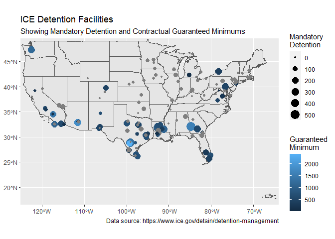

# Introduction

This document represents exploratory data analysis of ICE's Fiscal Year End Detention Reports. Currently, I am focusing on the FY21 dataset.


```r
library(sf)
library(ggplot2)
library(readxl)
library(tidyverse)
library(summarytools)
st_options(plain.ascii = FALSE,
           footnote = NA,
           subtitle.emphasis = FALSE,
           round.digits = 2)
library(knitr)
# knitr option that forces rounding
options(digits=3)
opts_chunk$set(results = 'asis',
               comment = NA,
               prompt = FALSE,
               cache = FALSE)
# knitr hook to put commas in the thousands place
# for inline numbers based on variables.
knit_hooks$set(inline = function(x) {
  prettyNum(x, big.mark=",")
})
```

## Load Data

Data were downloaded from the [ICE Detention Management](https://www.ice.gov/detain/detention-management) webpage.

Based on facility address, coordinates were established using [Geocodio](https://www.geocod.io/), appended to the spreadsheet and converted to a shapefile. This work was done using ArcGIS.


```r
# Load Datasets
facilities <- st_read("./map_data/Facilities_FY21.shp")
states <- st_read("./map_data/cb_2018_us_state_500k.shp")
```


```r
# Rename Fields
facilities <- rename(facilities,
       `Accuracy Score` = Accuracy_S,
       `Accuracy Type` = Accuracy_T,
       `Zip Geocoded` = Zip_Geocod,
       `Type Detailed` = Type_Detai,
       `Male/Female` = Male_Femal,
       `Level A` = Level_A,
       `Level B` = Level_B,
       `Level C` = Level_C,
       `Level D` = Level_D,
       `Male Crim` = Male_Crim,
       `Male Non Crim` = Male_Non_C,
       `Female Crim` = Female_Cri,
       `Female Non Crim` = Female_Non,
       `ICE Threat Level 1` = ICE_Threat,
       `ICE Threat Level 2` = ICE_Thre_1,
       `ICE Threat Level 3` = ICE_Thre_2,
       `ICE No Threat Level` = No_ICE_Thr,
       `Mandatory Detention` = Mandatory,
       `Guaranteed Minimum (character)` = Guaranteed,
       `Guaranteed Minimum` = Guarante_1,
       `Last Inspection Type` = Last_Inspe,
       `Last Inspection Standard` = Last_Ins_1,
       `Last Inspection Rating - Final` = Last_Ins_2,
       `Last Inspection Date` = Last_Ins_3,
       `Second to Last Inspection Type` = Second_to,
       `Second to Last Inspection Standard` = Second_t_1,
       `Second to Last Inspection Rating` = Second_t_2,
       `Second to Last Insepction Date` = Second_t_3,
  ) %>% 
  relocate(`Guaranteed Minimum`, .after = `Guaranteed Minimum (character)`) %>% 
  select(-`Guaranteed Minimum (character)`)

# Convert Field Type
facilities$`Guaranteed Minimum` <- as.numeric(facilities$`Guaranteed Minimum`)
```

# Summary Statistics

Calculate detention totals based on ICE's reported data.


```r
facilities <- facilities %>% 
  mutate(`Total Detained`=
           `Female Crim` +
           `Female Non Crim` +
           `Male Crim` +
           `Male Non Crim`) %>% 
  mutate(`Total Males Detained` =
           `Male Crim` +
           `Male Non Crim`) %>% 
  mutate(`Total Females Detained` =
           `Female Crim` +
           `Female Non Crim`) %>% 
  mutate(`Percent No Threat` =
            (`ICE No Threat Level` /
           `Total Detained`)*100) %>% 
  relocate(c(`Total Females Detained`,
             `Total Males Detained`,
             `Total Detained`,
             `Percent No Threat`), .after = `Guaranteed Minimum`)
```

List summary values


```r
facilities %>% 
  select(c(-`Accuracy Score`, -Longitude, -Latitude, -Zip, -`Zip Geocoded`)) %>% 
  descr(transpose = TRUE, stats = c("mean", "sd", "min", "med", "max"), headings = FALSE)
```

<div data-pagedtable="false">
  <script data-pagedtable-source type="application/json">
{"columns":[{"label":[""],"name":["_rn_"],"type":[""],"align":["left"]},{"label":["Mean"],"name":[1],"type":["dbl"],"align":["right"]},{"label":["Std.Dev"],"name":[2],"type":["dbl"],"align":["right"]},{"label":["Min"],"name":[3],"type":["dbl"],"align":["right"]},{"label":["Median"],"name":[4],"type":["dbl"],"align":["right"]},{"label":["Max"],"name":[5],"type":["dbl"],"align":["right"]}],"data":[{"1":"3.06","2":"6.77","3":"0","4":"0.0","5":"51","_rn_":"Female Crim"},{"1":"9.16","2":"28.16","3":"0","4":"0.0","5":"188","_rn_":"Female Non Crim"},{"1":"65.13","2":"67.91","3":"0","4":"53.0","5":"379","_rn_":"FY21_ALOS"},{"1":"687.80","2":"493.90","3":"2","4":"580.0","5":"2400","_rn_":"Guaranteed Minimum"},{"1":"54.14","2":"87.18","3":"0","4":"14.0","5":"513","_rn_":"ICE No Threat Level"},{"1":"31.68","2":"45.52","3":"0","4":"14.0","5":"276","_rn_":"ICE Threat Level 1"},{"1":"12.04","2":"16.02","3":"0","4":"6.0","5":"98","_rn_":"ICE Threat Level 2"},{"1":"11.46","2":"15.73","3":"0","4":"6.0","5":"94","_rn_":"ICE Threat Level 3"},{"1":"45.77","2":"84.26","3":"0","4":"9.0","5":"507","_rn_":"Level A"},{"1":"16.75","2":"26.20","3":"0","4":"6.5","5":"156","_rn_":"Level B"},{"1":"23.80","2":"33.45","3":"0","4":"10.0","5":"183","_rn_":"Level C"},{"1":"22.96","2":"34.32","3":"0","4":"10.0","5":"181","_rn_":"Level D"},{"1":"52.28","2":"71.07","3":"0","4":"26.5","5":"466","_rn_":"Male Crim"},{"1":"44.89","2":"76.74","3":"0","4":"12.0","5":"513","_rn_":"Male Non Crim"},{"1":"74.73","2":"95.63","3":"0","4":"35.0","5":"526","_rn_":"Mandatory Detention"},{"1":"37.80","2":"27.71","3":"0","4":"31.0","5":"100","_rn_":"Percent No Threat"},{"1":"109.40","2":"138.55","3":"0","4":"54.5","5":"734","_rn_":"Total Detained"},{"1":"12.23","2":"31.37","3":"0","4":"0.0","5":"195","_rn_":"Total Females Detained"},{"1":"97.18","2":"129.32","3":"0","4":"48.0","5":"734","_rn_":"Total Males Detained"}],"options":{"columns":{"min":{},"max":[10]},"rows":{"min":[10],"max":[10]},"pages":{}}}
  </script>
</div>

# Facility Types


```r
# convert character vector to factor vector
facilities$`Type Detailed` <- as.factor(facilities$`Type Detailed`)

# confirm the type is correct
class(facilities$`Type Detailed`)
# table(facilities$`Type Detailed`)
```


```r
facilities %>% 
  as_tibble() %>% 
  count(`Type Detailed`)
```

<div data-pagedtable="false">
  <script data-pagedtable-source type="application/json">
{"columns":[{"label":["Type Detailed"],"name":[1],"type":["fct"],"align":["left"]},{"label":["n"],"name":[2],"type":["int"],"align":["right"]}],"data":[{"1":"BOP","2":"2"},{"1":"CDF","2":"17"},{"1":"IGSA","2":"73"},{"1":"Other","2":"6"},{"1":"SPC","2":"5"},{"1":"USMS IGA","2":"39"}],"options":{"columns":{"min":{},"max":[10]},"rows":{"min":[10],"max":[10]},"pages":{}}}
  </script>
</div>


```r
facility_types <- facilities %>% 
  as_tibble() %>% 
  count(`Type Detailed`) %>% 
  mutate(`Percent Total` = prop.table(n)*100) %>% 
  mutate_at(3, funs(round(.,2)))
```

```
Warning: `funs()` was deprecated in dplyr 0.8.0.
Please use a list of either functions or lambdas: 

  # Simple named list: 
  list(mean = mean, median = median)

  # Auto named with `tibble::lst()`: 
  tibble::lst(mean, median)

  # Using lambdas
  list(~ mean(., trim = .2), ~ median(., na.rm = TRUE))
```

```r
facility_types %>% 
  arrange(`Percent Total`)
```

<div data-pagedtable="false">
  <script data-pagedtable-source type="application/json">
{"columns":[{"label":["Type Detailed"],"name":[1],"type":["fct"],"align":["left"]},{"label":["n"],"name":[2],"type":["int"],"align":["right"]},{"label":["Percent Total"],"name":[3],"type":["dbl"],"align":["right"]}],"data":[{"1":"BOP","2":"2","3":"1.41"},{"1":"SPC","2":"5","3":"3.52"},{"1":"Other","2":"6","3":"4.23"},{"1":"CDF","2":"17","3":"11.97"},{"1":"USMS IGA","2":"39","3":"27.46"},{"1":"IGSA","2":"73","3":"51.41"}],"options":{"columns":{"min":{},"max":[10]},"rows":{"min":[10],"max":[10]},"pages":{}}}
  </script>
</div>


```r
ggplot(facilities, aes(y = fct_infreq(`Type Detailed`)))+
  geom_bar(stat = 'count')+
  ylab("Facility Type Detailed")+
  xlab("Count")+
  labs(
    title = "ICE Detention Center Facility Type",
    caption = "Data source: https://www.ice.gov/detain/detention-management/"
  )
```

<!-- -->


```r
ggplot()+
  geom_sf(data=states)+
  geom_sf(data=facilities, aes(color = `Type Detailed`), size = 2)+
  scale_shape_discrete(solid = FALSE)+
  coord_sf(xlim = c(-125,-64), ylim = c(16.5, 49.5), expand = TRUE)+
  scale_x_continuous(breaks = c(-120, -100, -80))+
  labs(
    title = "ICE Detention Facility Type",
    caption = "Data source: https://www.ice.gov/detain/detention-management/"
    )+
  facet_wrap(~`Type Detailed`, ncol =3)
```

<!-- -->

## Guaranteed Minimums


Of the 142 facilities listed in the FY21 ICE Detention Year End Report 35% (n = 50) have Guaranteed Minimums as part of their contracts. Based on data reported by ICE, there are a total of 34,390 guaranteed beds in FY21. The table below lists those facilities in descending order based on the Guaranteed Minimum number of beds stipulated in the contract.


```r
facilities %>% 
  as_tibble() %>% 
  select(c(Name, `Guaranteed Minimum`, `Total Detained`, `Mandatory Detention`, `Percent No Threat`)) %>% 
  filter(`Guaranteed Minimum` >0) %>% 
  arrange(desc(`Guaranteed Minimum`))
```

<div data-pagedtable="false">
  <script data-pagedtable-source type="application/json">
{"columns":[{"label":["Name"],"name":[1],"type":["chr"],"align":["left"]},{"label":["Guaranteed Minimum"],"name":[2],"type":["dbl"],"align":["right"]},{"label":["Total Detained"],"name":[3],"type":["dbl"],"align":["right"]},{"label":["Mandatory Detention"],"name":[4],"type":["dbl"],"align":["right"]},{"label":["Percent No Threat"],"name":[5],"type":["dbl"],"align":["right"]}],"data":[{"1":"South Texas Family Residential Center","2":"2400","3":"299","4":"155","5":"99.33"},{"1":"La Palma Correctional Center","2":"1800","3":"428","4":"248","5":"77.57"},{"1":"La Palma Correction Center - Apso","2":"1800","3":"378","4":"247","5":"69.31"},{"1":"Stewart Detention Center","2":"1600","3":"673","4":"526","5":"30.61"},{"1":"Adelanto ICE Processing Center","2":"1455","3":"336","4":"221","5":"12.80"},{"1":"South Texas ICE Processing Center","2":"1350","3":"734","4":"464","5":"69.89"},{"1":"Tacoma ICE Processing Center (Northwest Det Ctr)","2":"1181","3":"311","4":"248","5":"16.40"},{"1":"Lasalle ICE Processing Center (Jena)","2":"1170","3":"464","4":"344","5":"55.17"},{"1":"Otay Mesa Detention Center (San Diego Cdf)","2":"1100","3":"352","4":"227","5":"53.98"},{"1":"Adams County Det Center","2":"1100","3":"348","4":"318","5":"65.80"},{"1":"Winn Correctional Center","2":"946","3":"365","4":"301","5":"57.26"},{"1":"Karnes County Residential Center","2":"830","3":"112","4":"34","5":"100.00"},{"1":"Port Isabel","2":"800","3":"392","4":"190","5":"83.16"},{"1":"Jackson Parish Correctional Center","2":"751","3":"184","4":"144","5":"72.83"},{"1":"Bluebonnet Detention Facility","2":"750","3":"374","4":"227","5":"31.02"},{"1":"Montgomery ICE Processing Center","2":"750","3":"329","4":"207","5":"46.50"},{"1":"El Valle Detention Facility","2":"750","3":"327","4":"175","5":"83.49"},{"1":"Houston Contract Detention Facility","2":"750","3":"190","4":"124","5":"58.95"},{"1":"Torrance County Detention Facility","2":"714","3":"24","4":"21","5":"41.67"},{"1":"Broward Transitional Center","2":"700","3":"331","4":"193","5":"77.64"},{"1":"South Louisiana Detention Center","2":"700","3":"84","4":"73","5":"71.43"},{"1":"Richwood Correctional Center","2":"677","3":"156","4":"134","5":"80.13"},{"1":"Imperial Regional Detention Facility","2":"640","3":"314","4":"203","5":"79.94"},{"1":"El Paso Service Processing Center","2":"600","3":"323","4":"159","5":"67.80"},{"1":"Irwin County Detention Center","2":"600","3":"314","4":"248","5":"31.85"},{"1":"Golden State Annex","2":"560","3":"83","4":"64","5":"3.61"},{"1":"Prairieland Detention Facility","2":"550","3":"292","4":"214","5":"31.85"},{"1":"Folkston Main Ipc","2":"544","3":"123","4":"50","5":"39.84"},{"1":"Denver Contract Detention Facility","2":"525","3":"218","4":"154","5":"19.72"},{"1":"York County Prison","2":"500","3":"327","4":"250","5":"22.94"},{"1":"Otero County Processing Center","2":"500","3":"188","4":"125","5":"55.85"},{"1":"Immigration Centers Of America Farmville","2":"500","3":"101","4":"70","5":"15.84"},{"1":"T. Don Hutto Detention Center","2":"461","3":"71","4":"52","5":"98.59"},{"1":"Krome North Service Processing Center","2":"450","3":"310","4":"217","5":"30.97"},{"1":"Denver Contract Detention Facility (Cdf) Ii","2":"432","3":"38","4":"28","5":"10.53"},{"1":"Buffalo (Batavia) Service Processing Center","2":"400","3":"252","4":"218","5":"18.65"},{"1":"Florence Service Processing Center","2":"392","3":"72","4":"44","5":"61.11"},{"1":"River Correctional Center","2":"361","3":"140","4":"109","5":"80.00"},{"1":"Iah Secure Adult Detention Facility (Polk)","2":"350","3":"76","4":"64","5":"60.53"},{"1":"Mesa Verde ICE Processing Center","2":"320","3":"43","4":"39","5":"2.33"},{"1":"Glades County Detention Center","2":"300","3":"257","4":"171","5":"28.02"},{"1":"Elizabeth Contract Detention Facility","2":"285","3":"102","4":"58","5":"75.49"},{"1":"Rio Grande Detention Center","2":"275","3":"155","4":"118","5":"69.68"},{"1":"Caroline Detention Facility","2":"224","3":"176","4":"108","5":"19.32"},{"1":"Yuba County Jail","2":"150","3":"19","4":"17","5":"0.00"},{"1":"Desert View","2":"120","3":"13","4":"11","5":"15.38"},{"1":"Allen Parish Public Safety Complex","2":"100","3":"64","4":"55","5":"84.38"},{"1":"San Luis Regional Detention Center","2":"100","3":"54","4":"31","5":"64.81"},{"1":"Calhoun County Correctional Center","2":"75","3":"114","4":"83","5":"18.42"},{"1":"Northwestern Regional Juvenile Detention Center","2":"2","3":"0","4":"0","5":"NaN"}],"options":{"columns":{"min":{},"max":[10]},"rows":{"min":[10],"max":[10]},"pages":{}}}
  </script>
</div>


```r
aggregate(x = facilities$`Guaranteed Minimum`,
          by = list(facilities$`Type Detailed`),
          FUN = sum, na.rm=TRUE) %>% 
  rename(`Type Detailed` = Group.1) %>% 
  rename(`Total Guaranteed Minimum` = x)
```

<div data-pagedtable="false">
  <script data-pagedtable-source type="application/json">
{"columns":[{"label":["Type Detailed"],"name":[1],"type":["fct"],"align":["left"]},{"label":["Total Guaranteed Minimum"],"name":[2],"type":["dbl"],"align":["right"]}],"data":[{"1":"BOP","2":"0"},{"1":"CDF","2":"10443"},{"1":"IGSA","2":"21305"},{"1":"Other","2":"0"},{"1":"SPC","2":"2642"},{"1":"USMS IGA","2":"0"}],"options":{"columns":{"min":{},"max":[10]},"rows":{"min":[10],"max":[10]},"pages":{}}}
  </script>
</div>


## Estimated number of "Ghost Beds"

Selman and Leighton [-@selman2010, 114] explain that compensation for private prisons is fraught with guarantees, including the payment of a minimum number of inmates which over time became standard language in many contracts. Selman and Leighton refer to the payment of nonexistent inmate beds through guaranteed minimums as "ghost inmates." Immigration detention is modeled on corrections and is effectively punishment imposed through a program of prevention through deterrence. However, individuals incarcerated by ICE are held in what is supposed to be non-punitive civil custody. Therefore, rather than referring to empty guaranteed beds that are paid for through contractual obligations as "ghost inmates" I refer to these in the immigration context as "ghost beds."


```r
ghost_beds <- facilities %>% 
  select(c(Name, `Guaranteed Minimum`, `Total Detained`, `Percent No Threat`)) %>% 
  filter(`Guaranteed Minimum` >0) %>% 
  mutate(`Estimated Ghost Beds` = `Guaranteed Minimum` - `Total Detained`) %>% 
  select(c(Name, `Estimated Ghost Beds`)) %>% 
  arrange(desc(`Estimated Ghost Beds`))
```


Based on ICE data, for FY21 there are a total of 22,960 ghost beds. Assuming an average cost of \$100 per day per bed, this comes out to \$2,296,000 per day paid for empty detention beds.


```r
as_tibble(ghost_beds) %>% 
  select(-geometry)
```

<div data-pagedtable="false">
  <script data-pagedtable-source type="application/json">
{"columns":[{"label":["Name"],"name":[1],"type":["chr"],"align":["left"]},{"label":["Estimated Ghost Beds"],"name":[2],"type":["dbl"],"align":["right"]}],"data":[{"1":"South Texas Family Residential Center","2":"2101"},{"1":"La Palma Correction Center - Apso","2":"1422"},{"1":"La Palma Correctional Center","2":"1372"},{"1":"Adelanto ICE Processing Center","2":"1119"},{"1":"Stewart Detention Center","2":"927"},{"1":"Tacoma ICE Processing Center (Northwest Det Ctr)","2":"870"},{"1":"Adams County Det Center","2":"752"},{"1":"Otay Mesa Detention Center (San Diego Cdf)","2":"748"},{"1":"Karnes County Residential Center","2":"718"},{"1":"Lasalle ICE Processing Center (Jena)","2":"706"},{"1":"Torrance County Detention Facility","2":"690"},{"1":"South Texas ICE Processing Center","2":"616"},{"1":"South Louisiana Detention Center","2":"616"},{"1":"Winn Correctional Center","2":"581"},{"1":"Jackson Parish Correctional Center","2":"567"},{"1":"Houston Contract Detention Facility","2":"560"},{"1":"Richwood Correctional Center","2":"521"},{"1":"Golden State Annex","2":"477"},{"1":"El Valle Detention Facility","2":"423"},{"1":"Montgomery ICE Processing Center","2":"421"},{"1":"Folkston Main Ipc","2":"421"},{"1":"Port Isabel","2":"408"},{"1":"Immigration Centers Of America Farmville","2":"399"},{"1":"Denver Contract Detention Facility (Cdf) Ii","2":"394"},{"1":"T. Don Hutto Detention Center","2":"390"},{"1":"Bluebonnet Detention Facility","2":"376"},{"1":"Broward Transitional Center","2":"369"},{"1":"Imperial Regional Detention Facility","2":"326"},{"1":"Florence Service Processing Center","2":"320"},{"1":"Otero County Processing Center","2":"312"},{"1":"Denver Contract Detention Facility","2":"307"},{"1":"Irwin County Detention Center","2":"286"},{"1":"El Paso Service Processing Center","2":"277"},{"1":"Mesa Verde ICE Processing Center","2":"277"},{"1":"Iah Secure Adult Detention Facility (Polk)","2":"274"},{"1":"Prairieland Detention Facility","2":"258"},{"1":"River Correctional Center","2":"221"},{"1":"Elizabeth Contract Detention Facility","2":"183"},{"1":"York County Prison","2":"173"},{"1":"Buffalo (Batavia) Service Processing Center","2":"148"},{"1":"Krome North Service Processing Center","2":"140"},{"1":"Yuba County Jail","2":"131"},{"1":"Rio Grande Detention Center","2":"120"},{"1":"Desert View","2":"107"},{"1":"Caroline Detention Facility","2":"48"},{"1":"San Luis Regional Detention Center","2":"46"},{"1":"Glades County Detention Center","2":"43"},{"1":"Allen Parish Public Safety Complex","2":"36"},{"1":"Northwestern Regional Juvenile Detention Center","2":"2"},{"1":"Calhoun County Correctional Center","2":"-39"}],"options":{"columns":{"min":{},"max":[10]},"rows":{"min":[10],"max":[10]},"pages":{}}}
  </script>
</div>


```r
ggplot()+
  geom_sf(data=states)+
  geom_sf(data=ghost_beds, aes(size=`Estimated Ghost Beds`))+
  coord_sf(xlim = c(-125,-64), ylim = c(16.5, 49.5), expand = FALSE)+
    labs(
    title = "ICE Detention Facilities",
    subtitle = "Showing Estimated Ghost Beds FY21",
    caption = "Data source: https://www.ice.gov/detain/detention-management/",
    size = "Estimated\nGhost Beds")
```

<!-- -->

## Threat Level


```r
no_threat <- 
  facilities %>% 
  select(c(Name, `Percent No Threat`, `Total Detained`)) %>% 
  arrange(desc(`Percent No Threat`))
as_tibble(no_threat) %>% 
  select(-geometry)
```

<div data-pagedtable="false">
  <script data-pagedtable-source type="application/json">
{"columns":[{"label":["Name"],"name":[1],"type":["chr"],"align":["left"]},{"label":["Percent No Threat"],"name":[2],"type":["dbl"],"align":["right"]},{"label":["Total Detained"],"name":[3],"type":["dbl"],"align":["right"]}],"data":[{"1":"Karnes County Residential Center","2":"100.00","3":"112"},{"1":"Cbp San Ysidro Poe","2":"100.00","3":"2"},{"1":"Madison County Jail","2":"100.00","3":"1"},{"1":"South Texas Family Residential Center","2":"99.33","3":"299"},{"1":"T. Don Hutto Detention Center","2":"98.59","3":"71"},{"1":"Cca, Florence Correctional Center","2":"85.71","3":"84"},{"1":"Cbp Chula Vista Bps","2":"84.62","3":"13"},{"1":"Allen Parish Public Safety Complex","2":"84.38","3":"64"},{"1":"El Valle Detention Facility","2":"83.49","3":"327"},{"1":"Clinton County Jail","2":"83.33","3":"6"},{"1":"Port Isabel","2":"83.16","3":"392"},{"1":"Webb County Detention Center (Cca)","2":"81.40","3":"86"},{"1":"Richwood Correctional Center","2":"80.13","3":"156"},{"1":"River Correctional Center","2":"80.00","3":"140"},{"1":"Imperial Regional Detention Facility","2":"79.94","3":"314"},{"1":"Broward Transitional Center","2":"77.64","3":"331"},{"1":"La Palma Correctional Center","2":"77.57","3":"428"},{"1":"Limestone County Detention Center","2":"76.71","3":"146"},{"1":"Eloy Federal Contract Facility","2":"76.64","3":"381"},{"1":"Laredo Processing Center","2":"75.79","3":"95"},{"1":"Elizabeth Contract Detention Facility","2":"75.49","3":"102"},{"1":"Jackson Parish Correctional Center","2":"72.83","3":"184"},{"1":"South Louisiana Detention Center","2":"71.43","3":"84"},{"1":"South Texas ICE Processing Center","2":"69.89","3":"734"},{"1":"Rio Grande Detention Center","2":"69.68","3":"155"},{"1":"La Palma Correction Center - Apso","2":"69.31","3":"378"},{"1":"El Paso Service Processing Center","2":"67.80","3":"323"},{"1":"Adams County Det Center","2":"65.80","3":"348"},{"1":"San Luis Regional Detention Center","2":"64.81","3":"54"},{"1":"Florence Service Processing Center","2":"61.11","3":"72"},{"1":"Iah Secure Adult Detention Facility (Polk)","2":"60.53","3":"76"},{"1":"Houston Contract Detention Facility","2":"58.95","3":"190"},{"1":"Winn Correctional Center","2":"57.26","3":"365"},{"1":"Joe Corley Processing Ctr","2":"56.25","3":"32"},{"1":"Otero County Processing Center","2":"55.85","3":"188"},{"1":"Pine Prairie ICE Processing Center","2":"55.30","3":"217"},{"1":"Lasalle ICE Processing Center (Jena)","2":"55.17","3":"464"},{"1":"Otay Mesa Detention Center (San Diego Cdf)","2":"53.98","3":"352"},{"1":"Etowah County Jail (Alabama)","2":"50.52","3":"97"},{"1":"Coastal Bend Detention Facility","2":"50.00","3":"4"},{"1":"Garvin County Detention Center","2":"50.00","3":"2"},{"1":"Montgomery ICE Processing Center","2":"46.50","3":"329"},{"1":"Florence Staging Facility","2":"45.95","3":"37"},{"1":"Clay County Jail","2":"45.10","3":"51"},{"1":"Strafford County Corrections","2":"45.07","3":"71"},{"1":"Euless City Jail","2":"42.86","3":"7"},{"1":"Torrance County Detention Facility","2":"41.67","3":"24"},{"1":"Plymouth County Correctional Facility","2":"40.74","3":"81"},{"1":"Folkston Main Ipc","2":"39.84","3":"123"},{"1":"Okmulgee County Jail","2":"39.24","3":"79"},{"1":"Rolling Plains Detention Center","2":"38.89","3":"36"},{"1":"Kay County Justice Facility","2":"38.78","3":"49"},{"1":"Monroe County Detention-Dorm","2":"37.50","3":"8"},{"1":"Essex County Correctional Facility","2":"37.32","3":"209"},{"1":"Johnson County Corrections Center","2":"36.36","3":"33"},{"1":"Alexandria Staging Facility","2":"36.00","3":"125"},{"1":"Mchenry County Correctional Facility","2":"33.33","3":"108"},{"1":"Orange County Jail","2":"33.33","3":"69"},{"1":"Saint Clair County Jail","2":"33.33","3":"27"},{"1":"Seneca County Jail","2":"33.33","3":"27"},{"1":"Collier County Naples Jail Center","2":"33.33","3":"3"},{"1":"Pike County Correctional Facility","2":"32.56","3":"43"},{"1":"Wyatt Detention Center","2":"32.26","3":"31"},{"1":"Prairieland Detention Facility","2":"31.85","3":"292"},{"1":"Irwin County Detention Center","2":"31.85","3":"314"},{"1":"Bluebonnet Detention Facility","2":"31.02","3":"374"},{"1":"Krome North Service Processing Center","2":"30.97","3":"310"},{"1":"Stewart Detention Center","2":"30.61","3":"673"},{"1":"Pulaski County Jail","2":"29.89","3":"87"},{"1":"Nevada Southern Detention Center","2":"29.76","3":"84"},{"1":"Kankakee County Jail (Jerome Combs Det Ctr)","2":"29.73","3":"37"},{"1":"Boone County Jail","2":"29.09","3":"55"},{"1":"Cambria County Jail","2":"28.57","3":"7"},{"1":"Rensselaer County Correctional Facility","2":"28.57","3":"7"},{"1":"Glades County Detention Center","2":"28.02","3":"257"},{"1":"Bergen County Jail","2":"27.95","3":"161"},{"1":"Baker County Sheriff'S Office","2":"27.16","3":"162"},{"1":"Henderson Detention Center","2":"26.61","3":"124"},{"1":"Eden Detention Center","2":"26.32","3":"95"},{"1":"Polk County Jail","2":"25.93","3":"27"},{"1":"Butler County Jail","2":"25.00","3":"92"},{"1":"Geauga County Jail","2":"25.00","3":"24"},{"1":"Chase County Detention Facility","2":"24.00","3":"50"},{"1":"Worcester County Jail","2":"23.81","3":"21"},{"1":"Robert A. Deyton Detention Facility","2":"23.53","3":"17"},{"1":"York County Prison","2":"22.94","3":"327"},{"1":"Franklin County House Of Correction","2":"22.73","3":"22"},{"1":"Hudson County Correctional Center","2":"22.54","3":"71"},{"1":"Freeborn County Adult Detention Center","2":"22.45","3":"49"},{"1":"Sherburne County Jail","2":"21.54","3":"65"},{"1":"Kandiyohi County Jail","2":"20.00","3":"70"},{"1":"Bristol County Detention Center","2":"20.00","3":"20"},{"1":"Pottawattamie County Jail","2":"20.00","3":"5"},{"1":"Teller County Jail","2":"20.00","3":"5"},{"1":"Denver Contract Detention Facility","2":"19.72","3":"218"},{"1":"Nye County Detention Center, Southern (Pahrump)","2":"19.70","3":"66"},{"1":"Caroline Detention Facility","2":"19.32","3":"176"},{"1":"Buffalo (Batavia) Service Processing Center","2":"18.65","3":"252"},{"1":"Calhoun County Correctional Center","2":"18.42","3":"114"},{"1":"Annex - Folkston Ipc","2":"18.42","3":"38"},{"1":"Wakulla County Jail","2":"16.67","3":"48"},{"1":"Tacoma ICE Processing Center (Northwest Det Ctr)","2":"16.40","3":"311"},{"1":"Immigration Centers Of America Farmville","2":"15.84","3":"101"},{"1":"Dodge County Jail","2":"15.71","3":"70"},{"1":"Desert View","2":"15.38","3":"13"},{"1":"Adelanto ICE Processing Center","2":"12.80","3":"336"},{"1":"Phelps County Jail","2":"12.50","3":"16"},{"1":"Washoe County Jail","2":"11.11","3":"9"},{"1":"Chippewa County Ssm","2":"11.11","3":"9"},{"1":"Hardin County Jail","2":"10.81","3":"37"},{"1":"Denver Contract Detention Facility (Cdf) Ii","2":"10.53","3":"38"},{"1":"Hall County Department Of Corrections","2":"9.52","3":"21"},{"1":"Howard County Detention Center","2":"7.14","3":"14"},{"1":"Douglas County Department Of Corrections","2":"6.25","3":"16"},{"1":"Honolulu Federal Detention Center","2":"5.88","3":"17"},{"1":"Golden State Annex","2":"3.61","3":"83"},{"1":"Clinton County Correctional Facility","2":"2.47","3":"81"},{"1":"Mesa Verde ICE Processing Center","2":"2.33","3":"43"},{"1":"Department Of Corrections Hagatna","2":"0.00","3":"22"},{"1":"Yuba County Jail","2":"0.00","3":"19"},{"1":"Saipan Department Of Corrections (Susupe)","2":"0.00","3":"4"},{"1":"Carver County Jail","2":"0.00","3":"4"},{"1":"Pickens County Det Ctr","2":"0.00","3":"3"},{"1":"Guaynabo Mdc (San Juan)","2":"0.00","3":"3"},{"1":"South Central Regional Jail","2":"0.00","3":"2"},{"1":"Linn County Jail","2":"0.00","3":"2"},{"1":"East Hidalgo Detention Center","2":"0.00","3":"2"},{"1":"Pinellas County Jail","2":"0.00","3":"1"},{"1":"Fayette County Detention Center","2":"0.00","3":"1"},{"1":"Sweetwater County Jail","2":"0.00","3":"1"},{"1":"Western Tennessee Detention Facility","2":"0.00","3":"1"},{"1":"La Paz County Adult Detention Facility","2":"NaN","3":"0"},{"1":"Erie County Jail","2":"NaN","3":"0"},{"1":"Holiday Inn Express & Suites","2":"NaN","3":"0"},{"1":"Grand Forks County Correctional Facility","2":"NaN","3":"0"},{"1":"Rockingham County Jail","2":"NaN","3":"0"},{"1":"Miller County Jail","2":"NaN","3":"0"},{"1":"Dorchester County Detention Center","2":"NaN","3":"0"},{"1":"Holiday Inn Express & Suites El Paso","2":"NaN","3":"0"},{"1":"Rio Grande County Jail","2":"NaN","3":"0"},{"1":"Hiland Mountain Correctional Center","2":"NaN","3":"0"},{"1":"Northwestern Regional Juvenile Detention Center","2":"NaN","3":"0"}],"options":{"columns":{"min":{},"max":[10]},"rows":{"min":[10],"max":[10]},"pages":{}}}
  </script>
</div>


```r
no_threat %>% 
ggplot()+
  geom_histogram(aes(`Percent No Threat`), bins = 20)
```

<!-- -->


```r
ggplot()+
  geom_sf(data=states)+
  geom_sf(data=`no_threat`, aes(size=`Percent No Threat`, color=`Total Detained`))+
  coord_sf(xlim = c(-125,-64), ylim = c(16.5, 49.5), expand = FALSE)+
    labs(
    title = "ICE Detention Facilities",
    subtitle = "Showing Estimated Percent No ICE Threat",
    caption = "Data source: https://www.ice.gov/detain/detention-management/",
    color = "Total\nDetained",
    size = "Estimated\n% No Threat")
```

```
Warning: Removed 11 rows containing missing values (geom_sf).
```

<!-- -->

## Mandatory Detention


```r
ggplot()+
  geom_sf(data=states)+
  geom_sf(data=facilities, aes(color = `Guaranteed Minimum`, size = `Mandatory Detention`))+
  coord_sf(xlim = c(-125,-64), ylim = c(16.5, 49.5), expand = FALSE)+
  labs(
    title = "ICE Detention Facilities",
    subtitle = "Showing Mandatory Detention and Contractual Guaranteed Minimums",
    caption = "Data source: https://www.ice.gov/detain/detention-management",
    color ="Guaranteed\nMinimum",
    size = "Mandatory\nDetention")
```

<!-- -->

# References
