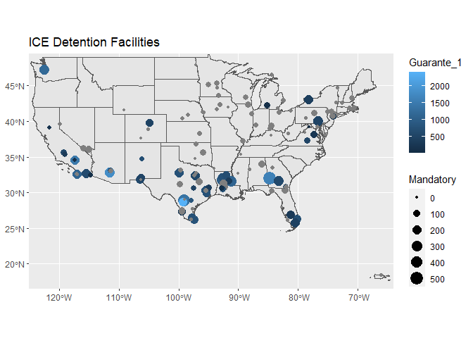

Some initial work with learning to plot spatial data in R.


```r
library(sf)
```

```
## Linking to GEOS 3.9.0, GDAL 3.2.1, PROJ 7.2.1
```

```r
library(ggplot2)
```

```r
facilities <- st_read("./map_data/Facilities_FY21.shp")
```

```
## Reading layer `Facilities_FY21' from data source `C:\Users\nmc\Nextcloud\AVID_Restricted\ICE_data\ICE-Detention-Year-End-Reports\map_data\Facilities_FY21.shp' using driver `ESRI Shapefile'
## Simple feature collection with 142 features and 39 fields
## Geometry type: POINT
## Dimension:     XY
## Bounding box:  xmin: -157.9283 ymin: 13.44426 xmax: 145.7408 ymax: 61.30192
## Geodetic CRS:  NAD83
```

```r
facilities_crop <- st_crop(facilities, xmin = -125, xmax = -64,
                                      ymin = 16.5, ymax = 49.5)
```

```
## although coordinates are longitude/latitude, st_intersection assumes that they are planar
```

```
## Warning: attribute variables are assumed to be spatially constant throughout all
## geometries
```


```r
states <- st_read("./map_data/cb_2018_us_state_500k.shp")
```

```
## Reading layer `cb_2018_us_state_500k' from data source `C:\Users\nmc\Nextcloud\AVID_Restricted\ICE_data\ICE-Detention-Year-End-Reports\map_data\cb_2018_us_state_500k.shp' using driver `ESRI Shapefile'
## Simple feature collection with 56 features and 9 fields
## Geometry type: MULTIPOLYGON
## Dimension:     XY
## Bounding box:  xmin: -179.1489 ymin: -14.5487 xmax: 179.7785 ymax: 71.36516
## Geodetic CRS:  NAD83
```

```r
states_crop <-  st_crop(states, xmin = -125, xmax = -64,
                                      ymin = 16.5, ymax = 49.5)
```

```
## although coordinates are longitude/latitude, st_intersection assumes that they are planar
```

```
## Warning: attribute variables are assumed to be spatially constant throughout all
## geometries
```


```r
main_map <- ggplot()+
  geom_sf(data=states)+
  geom_sf(data=facilities, aes(color = Guarante_1, size = Mandatory))+
  ggtitle("ICE Detention Facilities")+
  coord_sf()

main_map +
    coord_sf(xlim = c(-125,-64), ylim = c(16.5, 49.5), expand = FALSE)
```

```
## Coordinate system already present. Adding new coordinate system, which will replace the existing one.
```

<!-- -->


